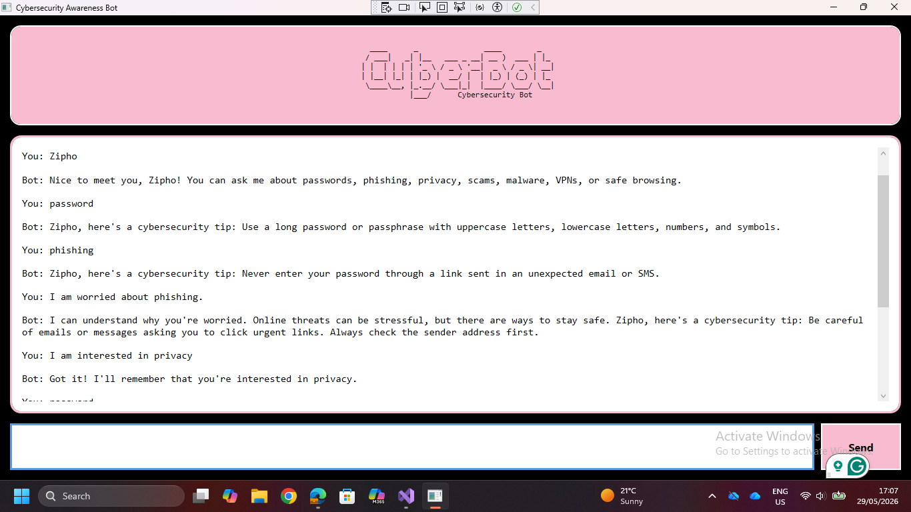

# Cybersecurity Awareness Bot

## Student Information

**Name:** Zipho
**Student Number:** ST10516063

---

## Project Description

The Cybersecurity Awareness Bot is a WPF-based chatbot developed in C#. The application helps users learn about cybersecurity topics such as phishing, password safety, malware, scams, privacy, VPNs, and safe browsing. The chatbot uses keyword recognition, sentiment detection, memory recall, and conversational flow to create a more interactive user experience.

---

## Features Implemented

### Part 1 Features

* Voice greeting using `greeting.wav`
* ASCII art display
* Personalised user interaction
* Cybersecurity awareness responses
* Input validation
* GitHub repository and CI workflow

### Part 2 Features

* WPF graphical user interface
* Scrollable chat history
* Keyword recognition for cybersecurity topics
* Randomised responses
* Conversation flow with follow-up support
* Sentiment detection
* User memory and recall
* Personalised responses
* Object-oriented design using multiple classes
* Error handling and fallback responses

---

## Cybersecurity Topics Supported

The chatbot recognises and responds to:

* Password Security
* Phishing
* Privacy
* Online Scams
* Malware
* VPN Usage
* Safe Browsing

---

## Technologies Used

* C#
* .NET 8.0
* Windows Presentation Foundation (WPF)
* Visual Studio 2022
* GitHub
* GitHub Actions

---

## Requirements

Before running the project, ensure you have:

* Windows Operating System
* Visual Studio 2022
* .NET 8.0 SDK

---

## How to Run the Application

1. Clone the repository:

```bash
git clone https://github.com/Zipho-R/CybersecurityChatbot.git
```

2. Open the solution in Visual Studio 2022.

3. Ensure `greeting.wav` is located in the project folder.

4. Set the file property:

```text
Copy to Output Directory = Copy Always
```

5. Build and run the project.

---

## How to Use the Chatbot

1. Launch the application.
2. Listen to the voice greeting.
3. Enter your name.
4. Ask cybersecurity questions.
5. Try:

   * password
   * phishing
   * privacy
   * malware
   * scam
   * vpn
   * browsing
6. Use:

   * tell me more
   * explain more
7. Test memory:

   * I am interested in privacy
8. Test sentiment:

   * I am worried about phishing
   * I am curious about malware
   * I am frustrated because I don't understand passwords

---

## Screenshots

### Running Application



---

## YouTube Demonstration

Unlisted Video Link: https://youtu.be/dV-LBfXXMMo?si=JIAXsiHnxPsrl8N 


---

## GitHub Repository

https://github.com/Zipho-R/CybersecurityChatbot

---

## Project Structure

```text
CybersecurityChatbot
│
├── MainWindow.xaml
├── MainWindow.xaml.cs
├── ChatBot.cs
├── KeywordResponder.cs
├── SentimentDetector.cs
├── MemoryStore.cs
├── AudioPlayer.cs
├── App.xaml
├── App.xaml.cs
├── greeting.wav
├── README.md
└── .github/workflows
```

---

## GitHub Commits

The project includes multiple commits showing development progress:

1. WPF project setup
2. GUI implementation
3. Keyword recognition
4. Sentiment detection
5. Memory implementation
6. ChatBot integration
7. Documentation updates

---

## Releases

### Version 2.0

* GUI implementation
* Voice greeting
* ASCII art
* Keyword recognition
* Random responses

### Version 2.1

* Sentiment detection
* Memory and recall
* Conversation flow
* Personalised responses
* Final improvements

---

## Declaration

This project was developed for PROG6221 Programming 2A and demonstrates the implementation of a cybersecurity awareness chatbot using object-oriented programming principles and a WPF graphical user interface.
